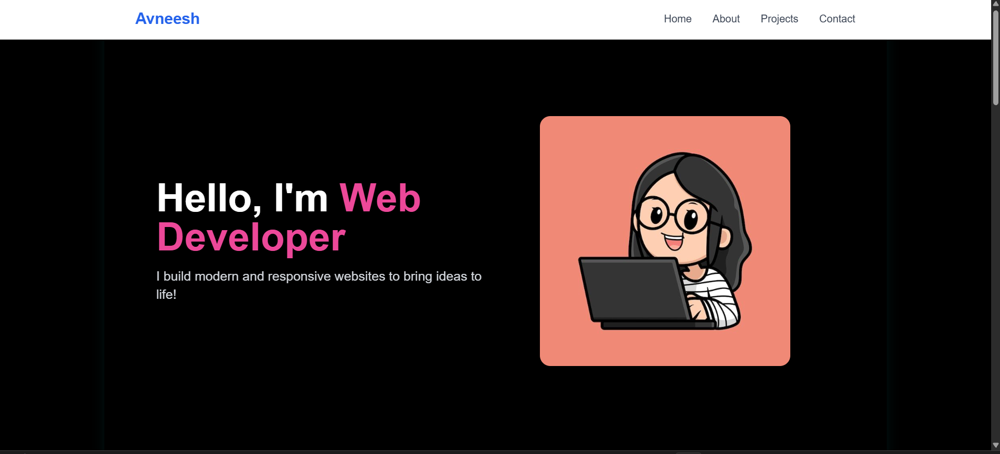
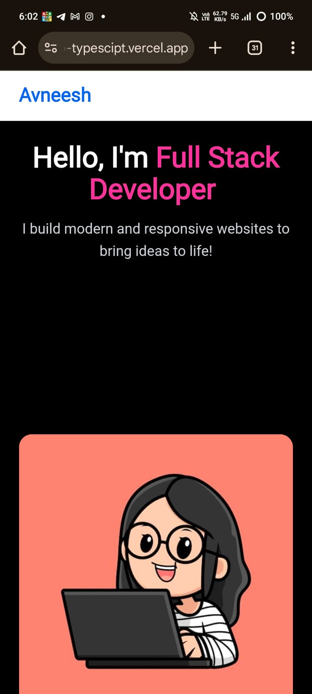

# Portfolio Website

A responsive portfolio website built with React.js showcasing my projects, skills, and experience.

## 🌐 Live Demo

🔗 **[View Live Website](https://my-portfolio-site.netlify.app)**

*Replace the above link with your actual deployed URL*

## 🚀 Getting Started

### Prerequisites
- Node.js (v14 or higher)
- npm or yarn

### Installation

1. Clone the repository
```bash
git clone https://github.com/avneeshkaur/Portfolio-Typescipt
```

2. Navigate to the project directory
```bash
cd Portfolio-Typescipt
```

3. Install dependencies
```bash
npm install
```

If you encounter peer dependency issues, try:
```bash
npm install --legacy-peer-deps
```

4. Start the development server
```bash
npm start
```

5. Open [http://localhost:3000](http://localhost:3000) to view it in the browser.

## 📦 Available Scripts

- `npm start` - Runs the app in development mode
- `npm test` - Launches the test runner
- `npm run build` - Builds the app for production
- `npm run eject` - Ejects from Create React App (one-way operation)

## 🎯 Features

- 📱 Fully responsive design
- ⚡ Fast and optimized performance
- 🎨 Modern UI/UX design
- 📄 Downloadable resume
- 📧 Contact form integration
- 🔗 Social media links
- 💼 Project showcase with live demos

## 🛠️ Built With

- **Frontend**: React.js, HTML5, CSS3
- **JavaScript**: ES6+
- **Styling**: CSS Modules / Styled Components / Tailwind CSS
- **Deployment**: Netlify / Vercel / GitHub Pages
- **Version Control**: Git & GitHub

## 📸 Screenshots

### Desktop View


### Mobile View


## 🚀 Deployment

This project is deployed on [Netlify/Vercel/GitHub Pages]. 

### Deploy your own copy:

#### Option 1: Netlify
1. Fork this repository
2. Sign up for [Netlify](https://netlify.com)
3. Connect your GitHub account
4. Select your forked repository
5. Build command: `npm run build`
6. Publish directory: `build`
7. Deploy!

## 📁 Project Structure

```
portfolio/
├── public/
│   ├── index.html
│   └── favicon.ico
├── src/
│   ├── components/
│   │   ├── Header/
│   │   ├── About/
│   │   ├── Projects/
│   │   ├── Skills/
│   │   ├── Contact/
│   │   └── Footer/
│   ├── assets/
│   │   ├── images/
│   │   └── files/
│   ├── styles/
│   ├── App.js
│   └── index.js
├── package.json
├── README.md
└── .gitignore
```

## 📄 License

This project is licensed under the MIT License.

## 📞 Contact

- **Email**: avneeshkaur.resume@gmail.com
- **LinkedIn**: [Your LinkedIn Profile](https://www.linkedin.com/in/avneeshkaur-dev/)
- **Portfolio**: [Live Website](https://avneesh-kaur-portfolio.netlify.app/)

## 🌟 Show Your Support

If you found this project helpful, please give it a ⭐ on GitHub!
